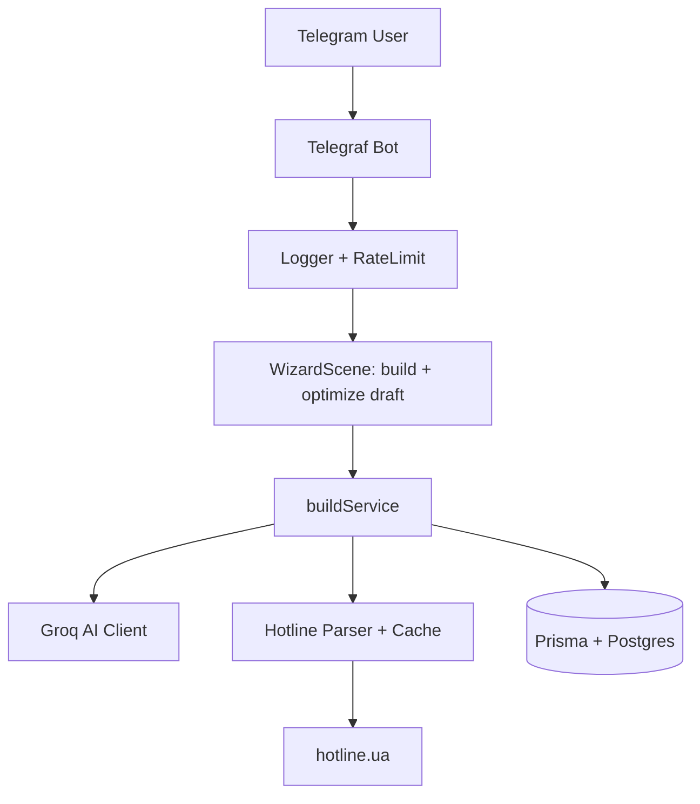

# PC Builder Telegram Bot

Інтелектуальний Telegram-бот для підбору комплектуючих ПК на основі бюджету та задач користувача.

## Функції

- `/start` — привітання та інструкція
- `/build` — покроковий підбір збірки (бюджет + задача)
- `/history` — перегляд попередніх збірок
- `/compare` — порівняння двох останніх збірок

Оптимізація чернетки (ціна / продуктивність) — кнопка «⚡ Оптимізувати збірку» під час `/build`, без окремої команди.

Бот використовує Groq (модель `llama-3.3-70b-versatile`) для генерації рекомендацій з поясненнями українською та парсить ціни з hotline.ua з 24-годинним кешем у БД.

## Встановлення

### Вимоги

- Node.js 20+
- Docker + Docker Compose (рекомендовано)
- Telegram Bot Token (отримати у @BotFather)
- Groq API Key (безкоштовно на groq.com)

### Швидкий старт з Docker

1. Клонуйте репозиторій
2. Скопіюйте `.env.example` → `.env` і заповніть:
   - `BOT_TOKEN`
   - `GROQ_API_KEY`
3. Запустіть:

```bash
docker compose up -d --build
```

4. Виконайте міграції Prisma (перший раз):

```bash
docker compose exec bot npx prisma migrate deploy
```

Бот автоматично запуститься.

### Локальний запуск (без Docker)

```bash
npm install
npx prisma generate
# Запустіть Postgres локально або через docker compose up postgres -d
npm run dev
```

## Архітектура



## Змінні середовища

| Змінна       | Опис                    |
| ------------ | ----------------------- |
| BOT_TOKEN    | Токен Telegram бота     |
| GROQ_API_KEY | Ключ Groq API           |
| DATABASE_URL | Посилання на PostgreSQL |

## Розробка

- `npm run dev` — запуск у режимі розробки
- `npm run build` — збірка
- `npx prisma studio` — перегляд БД

## Ліцензія

MIT
